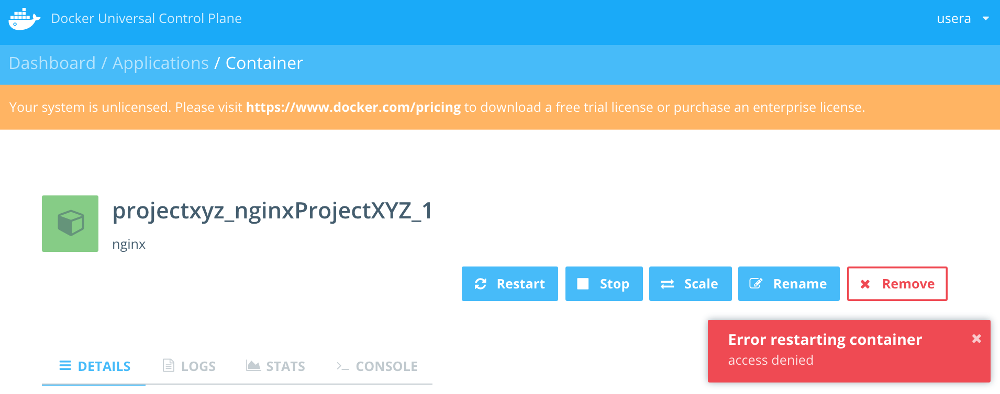
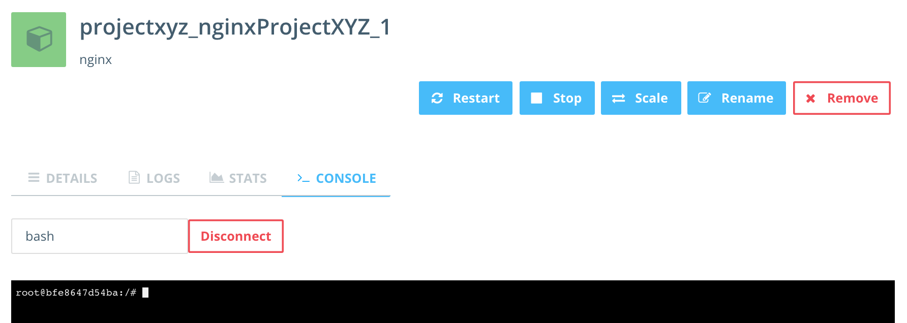

# Demo
https://docs.docker.com/ucp/configuration/dtr-integration/

## Demo outline
[Role] - [System] - [Action]
1. Admin - UCP - Show User/Team/Resource Labels
1. Dev - Dev - Push to Registry 
1. Dev - DTR - View new Image and Tag
1. Dev - UCP - Deploy via Compose
- a. Fail - access denied
4. Release - UCP - Deploy via Compose
- a. success - App created
5. Dev - UCP - View container (see logs, stats)

#### Roles
- Admin - admin
- Dev - drew
- Release - pablo

---
## Pre-setup for Demo

```
vagrant up docker1
#cat /etc/hosts | grep docker1

# log in to UCP - check 5 containers are started for DTR
# if not run following do following:
#
# Find --existing-replica-id at UCP web site Applications page
# eg "Docker Trusted Registry 2.0.3 - (Replica afb7d048d0ba)"
#
# REPLACE BELOW - "?" with valid id eg. "existing_replica_id=afb7d048d0ba"
# vagrant ssh docker1 -c 'export existing_replica_id=?; /home/vagrant/sync/scripts/supporting/dtr-re-install.sh'

```

### UCP
See https://docs.docker.com/ucp/user-management/permission-levels/
#### Create Users
- [dev-username], FullName=Dev_VO
  - Default Permission: View Only
- [release-username], FullName=Release_RC
  - Default Permission: Restricted Control

#### Create Teams
- dev-vo
  - Add user: [dev-username]
  - Permissions - add resource label
    - ProjectXYZ - View Only
- release-fc
  - Add user: [release-username]
  - Permission - add resource label
    - ProjectXYZ - Full Control
    - NOTE: Console requires FC

### DTR
- run script to create dtr accounts/teams

```
vagrant up ddc_docker_dev
vagrant ssh ddc_docker_dev -c '/home/vagrant/sync/presentation/demo/scripts/dtr-setup.sh'
vagrant ssh ddc_docker_dev -c '/home/vagrant/sync/presentation/demo/scripts/dev-push.sh v1v2'

```

----

## Start Demo

### Show ProjectXYZ website is down - http://IP:8080

### Admin - UCP - Show User/Team/Resource Labels

### Dev - Dev - Push to Registry
- Vagrant ssh to ddc_docker_dev box
- Run scripts
```
vagrant ssh ddc_docker_dev -c '/home/vagrant/sync/presentation/demo/scripts/dev-push.sh v3'

```

### Dev - DTR - View new Image and Tag
- Login as Dev - show uploaded image and tags

### Dev - UCP - Deploy via Compose 
- Login as [dev-username]
- Create Application - ProjectXYZ
  - /presentation/webB/release/docker-compose.yml
  - NOTE: update IP address
- Failure - access denied

### Release - UCP - Deploy via Compose
- Login as [release-username]
- Create Application - ProjectXYZ
  - /presentation/webB/release/docker-compose.yml
  - NOTE: update IP address
- Success

### Dev - UCP - View container (see logs, stats)
- Login as [dev-username]
- Show Containers list - show column Label
- View Container - show logs, stats pages

## End Demo
---

## Sample Images

###  Login as [dev-user]
EXPECT ERROR: Restart ProjectXYZ container
  - [dev-user] only has 'View Only'.
  - NOTE: buttons are still displayed but action results in error. 



### Login as Admin

EXPECT SUCCESS: ProjectXYZ connect console


